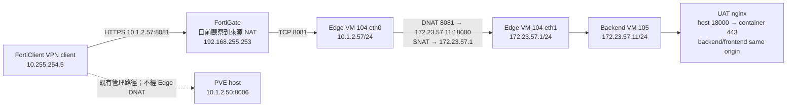

# 單一 IP、多服務 Port 的 PVE 私有網路架設教學

本教學說明如何在 Proxmox VE（PVE）上，以一個既有內部 IP `10.1.2.57` 對 FortiClient VPN 使用者發布多個服務。每個服務使用不同 TCP port，backend VM 不取得額外 `10.1.2.x` 位址，也不使用 DNS、WireGuard、公開信任 TLS 或 hostname routing。

內容以本環境實際完成並驗證的部署為基準；秘密值、GitLab token、VPN 帳密與應用 `.env` value 均不會出現在文件中。

> 目前已切換到 repository UAT revision `25201dbf1ba3475ebe9a69356c551e6394937f26`，由 UAT Compose 提供同源 frontend、backend、poller、Postgres、ClickHouse 與 nginx：
>
> - 入口：`https://10.1.2.57:8081`（自簽憑證，瀏覽器需略過一次警告）
> - API 文件：`https://10.1.2.57:8081/docs`
> - 健康檢查：`https://10.1.2.57:8081/healthz`
>
> UAT 的 `ENV=dev` 只啟用測試用假 SSO；不得放真實個資，也不能把此環境稱為 production-ready。UAT `Dockerfile.prod` image 與 production Kubernetes manifests 仍是不同交付階段。

## 1. 架構與流量路徑



Edge VM 是唯一網路邊界，不執行網站容器。正式應用放在私有 backend VM；PVE host 在私有 bridge 上沒有 IP。

### 本環境的固定配置

| 項目 | 設定 |
| --- | --- |
| PVE node | `pve`，管理位址 `10.1.2.50/24` |
| 外部 gateway | `10.1.2.254` |
| PVE resolver | `8.8.8.8` |
| 外部 bridge | `vmbr0` |
| 私有 bridge | `vmbr3`，PVE host 不配置 IP |
| 私有 subnet | `172.23.57.0/24` |
| Edge VM | VM 104 `single-ip-edge` |
| Edge 外部位址 | `10.1.2.57/24` |
| Edge 私有位址 | `172.23.57.1/24` |
| Backend VM | VM 105 `type-ai-platform-backend` |
| Backend 位址 | `172.23.57.11/24`，gateway `172.23.57.1` |
| Type AI entrance | TCP `8081`，HTTPS UAT nginx |
| Type AI backend endpoint | `172.23.57.11:18000` → nginx container `443` |
| 來源 template | VM 109 `ub-26-4-srv-docker` |
| VM storage | `VMdisk`；不使用 `local-zfs` |

移植到其他環境時，必須重新盤點所有位址、bridge、gateway、resolver、FortiGate 來源行為與 storage；不要直接複製以上數值。

## 2. 部署前 gate

任何一項未通過，都應停止，而不是以假設繼續。

### 2.1 管理與回復能力

- 已確認 PVE out-of-band console、IPMI、iKVM 或等效回復路徑。
- 目前 FortiClient session 可連 `10.1.2.50:8006`。
- 套用 PVE network 變更後，會立即重新驗證管理頁面。
- 操作者持有 backend／template 使用的 SSH private key；本環境使用：

  ```text
  C:\Users\User\.ssh\ci-template-key
  ```

### 2.2 IP、route 與 NAC

- `10.1.2.57` 已停止舊服務、排除 DHCP pool 並正式保留。
- 交換器／NAC 允許 Edge VM 的額外 MAC address。
- `172.23.57.0/24` 不與公司 LAN、FortiClient pool、site-to-site VPN 或 container subnet 重疊。
- VPN client route 涵蓋 `10.1.2.57`；本環境觀察到 `10.1.2.56/30`。

### 2.3 FortiGate empirical gate

若無法取得 policy ID、source group、client pool 與 NAT 設定，可在公司政策允許下使用時間點限定的實際連線測試，但必須明確記錄這只是 empirical validation。

1. 在當時持有 `10.1.2.57` 的測試主機暫時啟動 8081、8082 listeners。
2. 從已連 FortiClient 的 Windows client 執行：

   ```powershell
   Test-NetConnection 10.1.2.57 -Port 8081
   Test-NetConnection 10.1.2.57 -Port 8082
   ```

3. 兩個 `TcpTestSucceeded` 都必須為 `True`。
4. 測試完成後停止並刪除 listeners。

如果測試失敗且沒有 FortiGate 管理員可調整 policy，停止部署；不要擴大 port、加第二條 tunnel 或繞過公司網路政策。

### 2.4 Template 與 storage

記錄 VM 109 的基線：

- stopped template；
- 8 vCPU；
- 8 GiB maximum／2 GiB minimum balloon memory；
- 100G + 200G disks；
- net0 接 `vmbr0`；
- Cloud-Init 使用 DHCP。

建立 full clone 前，確認目標 storage 在 clone 後仍至少保留 20% 空間。本環境清理已核准的舊 2T VM 103 disk 後，`VMdisk` 可用約 4.19 TB，才繼續建立 Edge 與 backend clone。

> 不要把清理舊磁碟當成一般步驟。只有在識別精確 disk、完成資料搬移與 checksum、取得不可逆刪除核准後才能執行。

## 3. 建立私有 Linux bridge

在 PVE Web UI：

1. 選擇 node `pve`。
2. 進入 **System → Network**。
3. 選擇 **Create → Linux Bridge**。
4. 設定：

   | 欄位 | 值 |
   | --- | --- |
   | Name | `vmbr3` |
   | Autostart | Yes |
   | IPv4/CIDR | 空白 |
   | IPv4 gateway | 空白 |
   | IPv6/CIDR | 空白 |
   | Bridge ports | 空白 |
   | VLAN aware | No |
   | Comment | `single-ip-multi-site private bridge; no host IP` |

5. 儲存並按 **Apply Configuration**。
6. 確認 `vmbr3` 顯示 active／autostart。
7. 立即從 FortiClient client 驗證：

   ```powershell
   Test-NetConnection 10.1.2.50 -Port 8006
   ```

新增 bridge 不應修改 `vmbr0`、`vmbr1` 或 `vmbr2`。

## 4. 建立 Edge VM 104

### 4.1 Full Clone

在 PVE 左側選擇 VM 109：

1. **More → Clone**。
2. VM ID：`104`。
3. Name：`single-ip-edge`。
4. Mode：**Full Clone**。
5. Target Storage：`VMdisk`。
6. 等待 task 顯示 `OK`。

### 4.2 Hardware 與 Cloud-Init

| 項目 | 設定 |
| --- | --- |
| CPU | 2 vCPU |
| Memory | 4096 MiB |
| Ballooning | disabled |
| net0 | `vmbr0`，`10.1.2.57/24`，gateway `10.1.2.254` |
| net1 | `vmbr3`，`172.23.57.1/24`，不設第二個 gateway |
| Start at boot | Yes |
| Cloud-Init user | `mobagel` |
| SSH public key | template 使用的核准 key |

Regenerate Cloud-Init image 後啟動 VM。確認：

```bash
hostname
cloud-init status --wait
ip -br -4 addr
ip -4 route
```

預期只有一條 default route，經 `eth0` 到 `10.1.2.254`。

在 FortiClient client 的 `C:\Users\User\.ssh\config` 定義 Edge alias，後續以它作為 jump host：

```sshconfig
Host leadtek-type-ai-platform
    HostName 10.1.2.57
    User mobagel
    IdentityFile C:/Users/User/.ssh/ci-template-key
    IdentitiesOnly yes
```

驗證 alias 後再繼續：

```powershell
ssh -o BatchMode=yes leadtek-type-ai-platform hostname
```

### 4.3 將 Edge 收斂成網路邊界

Edge 不執行 application containers，因此停用 template 內的 Docker／containerd：

```bash
sudo systemctl disable --now docker.service docker.socket containerd.service
```

啟用 IPv4 forwarding：

```bash
printf '%s\n' 'net.ipv4.ip_forward=1' \
  | sudo tee /etc/sysctl.d/99-zz-single-ip-edge.conf >/dev/null
sudo sysctl --system
test "$(cat /proc/sys/net/ipv4/ip_forward)" = 1
```

檔名使用 `99-zz-`，是因 template 內另有較早排序的 sysctl file 將 forwarding 設為 0；必須確認最後套用結果為 1。

### 4.4 安裝 nftables 基線

本環境最後套用的完整規則位於：

```text
.scratch/single-ip-multi-site-network/nftables.edge.conf
```

初次建立 Edge 時，先使用沒有 DNAT tuple 的版本；只有 backend 私網 health 通過後才加入 8081。

每次更新都先驗證候選檔：

```bash
sudo nft -c -f /path/to/candidate.conf
```

通過後才備份與安裝：

```bash
stamp=$(date +%Y%m%d%H%M%S)
sudo cp -a /etc/nftables.conf "/etc/nftables.conf.before-single-ip-${stamp}"
sudo install -m 0644 /path/to/candidate.conf /etc/nftables.conf
sudo systemctl enable nftables
sudo systemctl reload nftables
sudo nft list ruleset
```

基線原則：

- input／forward default deny；
- established／related 回程允許；
- 私網 guest 只允許 ICMP、DNS、NTP、HTTP、HTTPS outbound；
- 私網 guest 主動連 `10.1.2.0/24` 明確 drop；
- 私網 outbound masquerade；
- 未配置 entrance port 沒有 catch-all backend。

## 5. 用隔離 Probe 驗證 NAT

在正式 backend 建立前，建立一台暫時 probe：

| 項目 | 設定 |
| --- | --- |
| Clone | VM 109 linked clone |
| Network | 只接 `vmbr3` |
| IP | `172.23.57.254/24` |
| Gateway | `172.23.57.1` |
| CPU／RAM | 1 vCPU／1 GiB 即可 |

從 probe 驗證：

```bash
getent ahostsv4 archive.ubuntu.com
curl -I --max-time 15 https://archive.ubuntu.com/ubuntu/
ping -c 2 1.1.1.1
```

PVE 管理連線必須被拒絕：

```bash
timeout 4 bash -lc '</dev/tcp/10.1.2.50/8006' \
  && echo UNEXPECTED_REACHABLE \
  || echo EXPECTED_BLOCKED
```

從 FortiClient client 直接連 probe 私網位址也必須失敗。驗收後正常關機並刪除 probe，不要留下 linked clone 或測試 IP。

## 6. 建立 Backend VM 105

### 6.1 Full Clone 與資源

再次從 VM 109 建立 full clone：

| 項目 | 設定 |
| --- | --- |
| VM ID | `105` |
| Name | `type-ai-platform-backend` |
| Mode | Full Clone |
| Storage | `VMdisk` |
| Disk | template 的 100G + 200G，約 300G |
| CPU | 8 vCPU |
| Memory | 65536 MiB |
| Ballooning | disabled |
| Network | 只接 `vmbr3` |
| IP | `172.23.57.11/24` |
| Gateway | `172.23.57.1` |
| Upgrade packages | No |
| Start at boot | Yes |

啟動後，經 Edge jump host 連線：

```powershell
ssh -J leadtek-type-ai-platform `
  -i C:\Users\User\.ssh\ci-template-key `
  mobagel@172.23.57.11
```

驗證：

```bash
cloud-init status --wait
nproc
grep MemTotal /proc/meminfo
ip -br -4 addr show eth0
ip -4 route
```

VM 不得取得 `10.1.2.x` 位址。

### 6.2 重新核對來源 VM

Clone 完成後再次檢查 VM 109 的 template／stopped 狀態、CPU、RAM、base disks、MAC 與 `vmbr0`。任何變更都必須先停止並調查。

## 7. 將 application 與 Docker 放到 `/srv`

Template 的 200G data disk 原始配置為：

- `/var/lib/docker`：80G LV；
- `/var/lib/containerd`：50G LV；
- `/srv`：20G LV。

直接把所有資料塞進原始 20G `/srv` 不合理。本環境保留原 80G Docker LV 與內容，把它改掛到 `/srv/platform`，再將 Docker data-root 設為 `/srv/platform/docker`。

先盤點且確認沒有既有 workload：

```bash
sudo docker info --format 'root={{.DockerRootDir}} containers={{.Containers}} images={{.Images}}'
sudo du -shx /var/lib/docker
sudo findmnt /var/lib/docker
sudo findmnt /srv
```

本環境當時為 0 containers、0 images、約 228K。若不是空環境，不要直接照搬；先制定資料搬移與 rollback。

安全順序：

1. 停止 Docker、socket 與 containerd。
2. 備份 `/etc/fstab`、`/etc/docker/daemon.json`。
3. 將原 Docker LV 的 fstab mountpoint 從 `/var/lib/docker` 改為 `/srv/platform`。
4. unmount 舊 mountpoint，建立並 mount `/srv/platform`。
5. 保留原有 Docker 內容，移到 `/srv/platform/docker`。
6. 建立：

   ```text
   /srv/platform/docker
   /srv/platform/type-ai-platform
   /srv/platform/app-data
   ```

7. 在 `/etc/docker/daemon.json` 設定：

   ```json
   {
     "data-root": "/srv/platform/docker"
   }
   ```

   如果原檔已有 log settings，合併 key，不要覆寫整份 JSON。

8. 啟動 containerd／Docker並驗證。

```bash
sudo docker info --format 'root={{.DockerRootDir}} containers={{.Containers}} images={{.Images}}'
findmnt /srv/platform
df -hT /srv/platform
```

重啟 backend VM 後必須再次驗證 mount 與 Docker root。剩餘空間低於 20% 時停止部署。

## 8. 準備秘密與 Git repository

### 8.1 產生 `SESSION_SECRET`

秘密來源存放在本機 ignored file：

```text
.secrets/apps/backend/.env
```

若沒有既有 session 需要保留，可以產生 32 random bytes。以下 PowerShell 不輸出 value：

```powershell
$ErrorActionPreference = 'Stop'
$envDir = Join-Path (Get-Location) '.secrets\apps\backend'
[IO.Directory]::CreateDirectory($envDir) | Out-Null
$envPath = Join-Path $envDir '.env'
if (-not [IO.File]::Exists($envPath)) {
  [IO.File]::WriteAllText(
    $envPath,
    "SESSION_SECRET=`n",
    [Text.UTF8Encoding]::new($false)
  )
}
$content = [IO.File]::ReadAllText($envPath)
$pattern = [Text.RegularExpressions.Regex]::new('(?m)^SESSION_SECRET=.*$')
if ($pattern.Matches($content).Count -ne 1) {
  throw 'Expected exactly one SESSION_SECRET entry'
}

$bytes = New-Object byte[] 32
$rng = [Security.Cryptography.RandomNumberGenerator]::Create()
try { $rng.GetBytes($bytes) } finally { $rng.Dispose() }
$secret = [Convert]::ToBase64String($bytes)

$updated = $pattern.Replace($content, "SESSION_SECRET=$secret", 1)
[IO.File]::WriteAllText(
  $envPath,
  $updated,
  [Text.UTF8Encoding]::new($false)
)
[Array]::Clear($bytes, 0, $bytes.Length)
$secret = $null
```

只驗證存在性與門檻：

```powershell
$line = Get-Content .secrets\apps\backend\.env |
  Where-Object { $_ -match '^SESSION_SECRET=' }
if ($line.Count -ne 1 -or ($line -replace '^SESSION_SECRET=', '').Length -lt 32) {
  throw 'SESSION_SECRET validation failed'
}
git check-ignore -q -- .secrets/apps/backend/.env
if ($LASTEXITCODE -ne 0) { throw 'env source is not Git ignored' }
```

不要使用固定字串、全零 bytes、空值或 repository 範例值。舊 session 存在時，輪替會使所有 session 失效，必須先取得核准。

### 8.2 安全 clone private GitLab repository

核准來源：

```text
https://source.mobagel.com/type-ai-platform/type-ai-platform.git
```

GitLab token 只應短暫出現在 SSH stdin 與 mode `0600` 臨時檔。不要：

- 把 token 放進 URL；
- 把 token 放進 command argument；
- 使用會把 password 拼進 username 的自訂 credential helper；
- 保留 `~/.netrc` 或 `~/.git-credentials`。

安全作法是使用短生命週期 `GIT_ASKPASS`，並在 `trap` 中刪除 token／script。askpass 必須放在允許 execute 的 filesystem；本環境 `/tmp` 為 `noexec`，因此使用使用者家目錄的暫時目錄。

在 FortiClient client 執行下列單一 SSH 流程。token 只在 stdin 與遠端 mode `0600` 臨時檔中短暫存在；外層 remote shell 在 clone 成功、失敗或 SSH 中斷時都執行 cleanup，指令不顯示 value：

```powershell
$ErrorActionPreference = 'Stop'
$token = [IO.File]::ReadAllText(
  (Resolve-Path '.secrets\gitlab-access-token.txt')
).Trim()
if ([string]::IsNullOrWhiteSpace($token) -or
    $token.Contains("`n") -or $token.Contains("`r")) {
  throw 'GitLab token source must contain exactly one non-empty line'
}

$remoteScript = @'
set -eu
cat >"$ASKPASS_DIR/askpass.sh" <<'EOF'
#!/bin/sh
case "$1" in
  *Username*) printf '%s\n' 'oauth2' ;;
  *Password*) cat "$GIT_TOKEN_FILE" ;;
  *) exit 1 ;;
esac
EOF
chmod 0700 "$ASKPASS_DIR/askpass.sh"
mkdir -p /srv/platform
GIT_ASKPASS="$ASKPASS_DIR/askpass.sh" \
GIT_TERMINAL_PROMPT=0 \
git clone \
  https://source.mobagel.com/type-ai-platform/type-ai-platform.git \
  /srv/platform/type-ai-platform
'@

$remoteWrapper = @'
set -eu
umask 077
token_file=$(mktemp "$HOME/.gitlab-token.XXXXXX")
askpass_dir=$(mktemp -d "$HOME/.git-askpass.XXXXXX")
cleanup() { rm -f "$token_file"; rm -rf "$askpass_dir"; }
trap cleanup EXIT HUP INT TERM
IFS= read -r token
printf '%s' "$token" >"$token_file"
unset token
export GIT_TOKEN_FILE="$token_file" ASKPASS_DIR="$askpass_dir"
sh -s
'@

$payload = $token + "`n" + $remoteScript
try {
  $payload | ssh -o BatchMode=yes -J leadtek-type-ai-platform `
    -i C:\Users\User\.ssh\ci-template-key `
    mobagel@172.23.57.11 $remoteWrapper
  if ($LASTEXITCODE -ne 0) { throw 'Secure Git clone failed' }
} finally {
  $token = $null
  $payload = $null
}
```

Clone 完成後記錄 revision，不記錄 credential：

```bash
cd /srv/platform/type-ai-platform
git rev-parse HEAD
git remote get-url origin
git status --short
```

本次部署 revision：

```text
25201dbf1ba3475ebe9a69356c551e6394937f26
```

### 8.3 比對環境 key

比對：

- `.env.uat.example`；
- `apps/backend/app/config.py` 的 `Settings`；
- ignored `.secrets/apps/backend/.env`。

只回報 key 名稱、required／optional、present／empty／missing 與格式結果。不要輸出 value。

UAT 由 Compose interpolation 與 backend `env_file` 使用下列 key：

```text
ENV
SESSION_SECRET
POSTGRES_PASSWORD
CLICKHOUSE_PASSWORD
UAT_SERVER_NAME
```

`DATABASE_URL` 與 `CLICKHOUSE_URL` 不放在 `.env.uat`；UAT Compose 會以 compose service name 與資料庫密碼組合它們。不要把開發用 `apps/backend/.env` 上傳後誤當成 UAT 設定。部署時只把本機 ignored source 的 `SESSION_SECRET` 安全地帶入遠端 `.env.uat`，資料庫密碼在 backend VM 上以 cryptographic RNG 產生。

遠端驗證只報告 key 名稱、存在狀態、格式與 mode `0600`，不輸出任何 value；`.env.uat` 必須被 Git ignore。

## 9. 部署 UAT containers

UAT 使用 repository 的 `docker-compose.uat.yml`，由同一套 `Dockerfile.prod` 建立 frontend／backend image，並以 nginx 將 frontend 與 API 維持同源。UAT 的 `ENV` 必須是 `dev`，因為目前登入是測試用假 SSO；不可放真實個資。

### 9.1 建立 UAT env 與 host-port override

首次部署時，在 backend VM 產生 `/srv/platform/type-ai-platform/.env.uat`，設定 mode `0600`，至少包含：

```text
UAT_SERVER_NAME=10.1.2.57
POSTGRES_PASSWORD=<random>
CLICKHOUSE_PASSWORD=<random>
ENV=dev
SESSION_SECRET=<random>
```

不要把值寫入 Git、ticket、terminal transcript 或一般 log。UAT 入口需使用 backend host port `18000`，但將它接到 nginx container 的 HTTPS `443`，因此在 Git 之外建立：

```text
/srv/platform/app-data/type-ai-platform/compose.uat.deploy.yml
```

```yaml
services:
  nginx:
    ports: !override
      - "172.23.57.11:18000:443"
```

UAT nginx 會把自簽 certificate／key 放在 named volume
`type-ai-platform-uat_nginx-certs`。一般 container rebuild 會保留這個 volume，
所以不會無故改變瀏覽器例外；刪除 volume 或從沒有該 volume 的備份還原時，
必須視為憑證輪替並重新記錄 SHA-256 fingerprint。正常更新不得重新產生
`.env.uat` 的資料庫密碼或 `SESSION_SECRET`；只有另行核准的 rotation 才能改值。

### 9.2 UAT build、migration 與啟動

先做 quiet validation，避免印出 resolved env：

```bash
docker compose --env-file .env.uat \
  -f docker-compose.uat.yml \
  -f /srv/platform/app-data/type-ai-platform/compose.uat.deploy.yml \
  config -q
```

停止舊 dev stack 時不要加 `-v`，保留既有 volumes；再建置並套用兩套 migration：

```bash
docker compose --env-file .env.uat \
  -f docker-compose.uat.yml \
  -f /srv/platform/app-data/type-ai-platform/compose.uat.deploy.yml \
  build

docker compose --env-file .env.uat \
  -f docker-compose.uat.yml \
  -f /srv/platform/app-data/type-ai-platform/compose.uat.deploy.yml \
  run --rm backend alembic upgrade head

docker compose --env-file .env.uat \
  -f docker-compose.uat.yml \
  -f /srv/platform/app-data/type-ai-platform/compose.uat.deploy.yml \
  run --rm backend python -m app.telemetry.clickhouse

docker compose --env-file .env.uat \
  -f docker-compose.uat.yml \
  -f /srv/platform/app-data/type-ai-platform/compose.uat.deploy.yml \
  up -d
```

### 9.3 私網 UAT health gate

Backend VM 與 Edge VM 都使用自簽 HTTPS 驗證：

```bash
curl -kfsS https://172.23.57.11:18000/healthz
```

兩者都必須回：

```json
{"status":"ok"}
```

自簽例外只適用於固定的 UAT 私有端點。部署時把目前 certificate 的 SHA-256
fingerprint 從 named volume 的 `server.crt` 建立後，以 atomic write 寫入
root-owned `0644` 檔案 `/etc/type-ai-platform/uat-nginx-cert.sha256`（只寫
fingerprint，不要寫入 ticket 或一般 log），並以 `openssl x509 -checkend
2592000` 檢查至少 30 天有效期。`type-ai-platform-health.timer` 會週期性比對
fingerprint 與有效期；expected file 只讀，不從可由 application user 寫入的
`/srv/platform/app-data` 目錄載入。

初始化 pin 時只從 named volume 的 `server.crt` 讀取，並以 root-owned atomic
write 建立檔案；此指令不輸出 fingerprint value：

```bash
set -euo pipefail
sudo install -d -o root -g root -m 0755 /etc/type-ai-platform
tmp=$(sudo mktemp /etc/type-ai-platform/.uat-nginx-cert.sha256.XXXXXX)
trap 'sudo rm -f "$tmp"' EXIT
fingerprint=$(sudo openssl x509 \
  -in /srv/platform/docker/volumes/type-ai-platform-uat_nginx-certs/_data/server.crt \
  -noout -fingerprint -sha256 |
  sed 's/^sha256 Fingerprint=//; s/://g')
if ! printf '%s\n' "$fingerprint" | grep -Eq '^[[:xdigit:]]{64}$'; then
  echo 'certificate fingerprint validation failed' >&2
  exit 1
fi
printf '%s\n' "$fingerprint" | sudo tee "$tmp" >/dev/null
sudo chown root:root "$tmp"
sudo chmod 0644 "$tmp"
sudo mv -f "$tmp" /etc/type-ai-platform/uat-nginx-cert.sha256
trap - EXIT
```

這不是把憑證驗證靜默關閉，未來 production endpoint 必須改用可驗證的信任鏈。

確認 backend、frontend、poller、Postgres、ClickHouse、nginx 都 running 且 migration 成功後，才保留 Edge 的 8081 DNAT。

### 9.4 Backend service-port source restriction

Docker published port 經 Docker FORWARD chain，不一定受一般 host input rule 控制。建立可重複執行的 `DOCKER-USER` 規則，只允許 Edge `.1` 進入 original destination port 18000：

```bash
sudo tee /usr/local/sbin/type-ai-platform-firewall >/dev/null <<'EOF'
#!/bin/sh
set -eu
IPTABLES=/usr/sbin/iptables
$IPTABLES -N DOCKER-USER 2>/dev/null || true
$IPTABLES -C DOCKER-USER -i eth0 -s 172.23.57.1/32 -p tcp -m conntrack --ctorigdstport 18000 -j ACCEPT 2>/dev/null || \
  $IPTABLES -I DOCKER-USER 1 -i eth0 -s 172.23.57.1/32 -p tcp -m conntrack --ctorigdstport 18000 -j ACCEPT
while $IPTABLES -C DOCKER-USER -i eth0 -p tcp -m conntrack --ctorigdstport 18000 -m limit --limit 5/second --limit-burst 10 -j LOG --log-prefix 'type-ai-drop ' 2>/dev/null; do
  $IPTABLES -D DOCKER-USER -i eth0 -p tcp -m conntrack --ctorigdstport 18000 -m limit --limit 5/second --limit-burst 10 -j LOG --log-prefix 'type-ai-drop '
done
while $IPTABLES -C DOCKER-USER -i eth0 -p tcp -m conntrack --ctorigdstport 18000 -j DROP 2>/dev/null; do
  $IPTABLES -D DOCKER-USER -i eth0 -p tcp -m conntrack --ctorigdstport 18000 -j DROP
done
$IPTABLES -I DOCKER-USER 2 -i eth0 -p tcp -m conntrack --ctorigdstport 18000 -m limit --limit 5/second --limit-burst 10 -j LOG --log-prefix 'type-ai-drop '
$IPTABLES -I DOCKER-USER 3 -i eth0 -p tcp -m conntrack --ctorigdstport 18000 -j DROP
EOF
sudo chmod 0755 /usr/local/sbin/type-ai-platform-firewall

sudo tee /etc/systemd/system/type-ai-platform-firewall.service >/dev/null <<'EOF'
[Unit]
Description=Restrict Type AI Platform Docker port to Edge VM
After=docker.service network-online.target
Wants=docker.service network-online.target

[Service]
Type=oneshot
ExecStart=/usr/local/sbin/type-ai-platform-firewall
RemainAfterExit=yes

[Install]
WantedBy=multi-user.target
EOF

sudo mkdir -p /etc/systemd/system/docker.service.d
sudo tee /etc/systemd/system/docker.service.d/type-ai-platform-firewall.conf >/dev/null <<'EOF'
[Service]
ExecStartPost=/usr/local/sbin/type-ai-platform-firewall
EOF

sudo systemctl daemon-reload
sudo systemctl enable --now type-ai-platform-firewall.service
sudo systemctl is-active --quiet type-ai-platform-firewall.service
sudo systemctl show docker.service -p DropInPaths
sudo iptables -S DOCKER-USER
```

Docker 的同步 `ExecStartPost` drop-in 確保每次 daemon start／restart 都在標示 active 前重新套用規則；若 script 失敗，Docker start 也會失敗。後面的 health script 另會直接檢查三條實際規則，避免 oneshot 仍顯示 active、實際 chain 卻已被重建的假健康狀態。

可在 Edge 暫時加入測試來源 IP，驗證 `.1` 可達、其他來源被拒絕；測試後立即移除 temporary IP。

## 10. 發布 TCP 8081

Backend 私網 health 通過後，才在 Edge nftables 加入三個配對規則：

1. forward：只允許目前 empirical FortiGate source peer 到 `.11:18000`；
2. prerouting：`8081` DNAT 到 `.11:18000`；
3. postrouting：同一 flow SNAT 成 Edge `.1`。

SNAT 不能省略。本環境 FortiGate peer `192.168.255.253` 會被 DNAT 保留成原始 source；若 backend 只允許 Edge `.1`，沒有 SNAT 就會正確地把 VPN 流量 drop。

目前規則的關鍵片段：

```nft
iifname "eth0" oifname "eth1" \
  ip saddr 192.168.255.253 ip daddr 172.23.57.11 \
  tcp dport 18000 ct status dnat accept

iifname "eth0" ip saddr 192.168.255.253 tcp dport 8081 \
  dnat to 172.23.57.11:18000

iifname "eth0" oifname "eth1" \
  ip saddr 192.168.255.253 ip daddr 172.23.57.11 \
  tcp dport 18000 snat to 172.23.57.1
```

先 `nft -c -f`，再備份、install、reload。

### 10.1 VPN seam 驗收

```powershell
Test-NetConnection 10.1.2.57 -Port 8081
curl.exe -kfsS https://10.1.2.57:8081/healthz
curl.exe -kfsS -o NUL -w "%{http_code}`n" https://10.1.2.57:8081/docs
curl.exe -kfsS -o NUL -w "%{http_code}`n" https://10.1.2.57:8081/openapi.json
```

同時確認：

- 8081 TCP 成功、HTTPS health／docs／openapi 回 HTTP 200；
- `https://10.1.2.57:8081/` 回 frontend HTTP 200；
- UAT `ENV=dev` 的 `/internal/v1/auth/dev/login` 與 `/internal/v1/me` 僅使用測試 email 驗證，不使用真實個資；
- 8082、8083 等未配置 ports 失敗；
- `172.23.57.11:18000` 無法由 VPN client 直接連線；
- `10.1.2.50:8006` 的既有管理路徑未被本功能修改。

本環境驗收來源為 FortiClient interface `乙太網路 3`、client address `10.255.254.5`。這不代表已知完整 FortiGate policy scope。

## 11. 驗證多 port 與 WebSocket

為證明同一個 IP 能安全分流多個服務，可建立一個短生命週期的第二 backend：

- private IP：`172.23.57.12`；
- local service port：同樣使用 `18000`；
- temporary entrance：8082；
- response 必須與 8081 可辨識；
- unit 應設定自動到期時間。

如果正式 Docker backend 原本綁 `0.0.0.0:18000`，`.12:18000` 會顯示 address already in use。把正式 backend 收斂為 `172.23.57.11:18000`，才能讓 `.12` 重用相同 port。

暫時加入 8082 的 forward／DNAT／SNAT tuple 後驗證：

- 8081 回 `{"status":"ok"}`；
- 8082 回第二服務識別內容；
- 標準 WebSocket headers 可取得 `101 Switching Protocols`；
- 8083 仍 fail closed；
- client-supplied `Forwarded`／`X-Forwarded-For` 不影響 backend identity。

完成後：

1. 移除 8082 的三個 nft tuples；
2. 停止 transient unit；
3. 刪除 `.12` secondary IP 與 temporary script；
4. 確認 8081 仍正常，8082、8083 與 `.12` 都不可達。

## 12. 自動恢復、監控與紀錄

### Edge

`single-ip-edge-health.timer` 每分鐘檢查：

- `net.ipv4.ip_forward=1`；
- nftables active；
- 8081 DNAT tuple 存在；
- Edge 以 `curl -k` 到 `.11:18000/healthz` 正常。

在 Edge 建立 script、oneshot service 與 timer：

```bash
sudo tee /usr/local/sbin/single-ip-edge-health >/dev/null <<'EOF'
#!/bin/sh
set -eu
test "$(cat /proc/sys/net/ipv4/ip_forward)" = "1"
systemctl is-active --quiet nftables
nft list chain ip edge_nat prerouting | grep -Fq 'tcp dport 8081 dnat to 172.23.57.11:18000'
test "$(curl -kfsS --max-time 5 https://172.23.57.11:18000/healthz)" = '{"status":"ok"}'
EOF
sudo chmod 0755 /usr/local/sbin/single-ip-edge-health

sudo tee /etc/systemd/system/single-ip-edge-health.service >/dev/null <<'EOF'
[Unit]
Description=Check single-IP Edge routing and Type AI backend
After=network-online.target nftables.service
Wants=network-online.target

[Service]
Type=oneshot
ExecStart=/usr/local/sbin/single-ip-edge-health
EOF

sudo tee /etc/systemd/system/single-ip-edge-health.timer >/dev/null <<'EOF'
[Unit]
Description=Run single-IP Edge health checks

[Timer]
OnBootSec=2min
OnUnitActiveSec=1min
AccuracySec=10s
Persistent=true

[Install]
WantedBy=timers.target
EOF

sudo systemctl daemon-reload
sudo systemctl start single-ip-edge-health.service
sudo systemctl enable --now single-ip-edge-health.timer
```

### Backend

`type-ai-platform-health.timer` 每五分鐘檢查：

- Docker active；
- UAT 的 Postgres、ClickHouse、backend、poller、frontend、nginx containers running；
- backend health；
- UAT certificate 至少 30 天有效，且 SHA-256 fingerprint 與受保護的 expected file 相符；
- outbound HTTPS；
- `/srv/platform` used 不超過 80%。

下列 container names 對應本次 Compose project；若 project name 不同，先用 `docker ps --format '{{.Names}}'` 核對再修改。於 backend 建立：

```bash
sudo tee /usr/local/sbin/type-ai-platform-health >/dev/null <<'EOF'
#!/bin/sh
set -eu
systemctl is-active --quiet docker
systemctl is-active --quiet type-ai-platform-firewall.service
iptables -C DOCKER-USER -i eth0 -s 172.23.57.1/32 -p tcp -m conntrack --ctorigdstport 18000 -j ACCEPT
iptables -C DOCKER-USER -i eth0 -p tcp -m conntrack --ctorigdstport 18000 -m limit --limit 5/second --limit-burst 10 -j LOG --log-prefix 'type-ai-drop '
iptables -C DOCKER-USER -i eth0 -p tcp -m conntrack --ctorigdstport 18000 -j DROP
for container in \
  type-ai-platform-uat-postgres-1 \
  type-ai-platform-uat-clickhouse-1 \
  type-ai-platform-uat-backend-1 \
  type-ai-platform-uat-poller-1 \
  type-ai-platform-uat-frontend-1 \
  type-ai-platform-uat-nginx-1; do
  test "$(docker inspect --format={{.State.Running}} "$container")" = "true"
done
cert_tmp=$(mktemp)
cleanup() { rm -f "$cert_tmp"; }
trap cleanup EXIT HUP INT TERM
openssl s_client -connect 172.23.57.11:18000 -servername 10.1.2.57 </dev/null 2>/dev/null | openssl x509 -out "$cert_tmp"
openssl x509 -in "$cert_tmp" -checkend 2592000 -noout
cert_fingerprint=$(openssl x509 -in "$cert_tmp" -noout -fingerprint -sha256 | sed 's/^sha256 Fingerprint=//; s/://g')
expected_fingerprint=$(tr -d '\r\n' < /etc/type-ai-platform/uat-nginx-cert.sha256)
test -n "$expected_fingerprint"
test "$cert_fingerprint" = "$expected_fingerprint"
test "$(curl -kfsS --max-time 5 https://172.23.57.11:18000/healthz)" = '{"status":"ok"}'
used_pct=$(df -P /srv/platform | awk 'NR == 2 { gsub("%", "", $5); print $5 }')
if test "$used_pct" -gt 80; then
  echo "type-ai-platform storage headroom below 20 percent: used=${used_pct}%" >&2
  exit 1
fi
curl -IfsS --max-time 10 https://archive.ubuntu.com/ubuntu/ >/dev/null
EOF
sudo chmod 0755 /usr/local/sbin/type-ai-platform-health

sudo tee /etc/systemd/system/type-ai-platform-health.service >/dev/null <<'EOF'
[Unit]
Description=Check Type AI Platform containers, storage, and outbound path
After=network-online.target docker.service type-ai-platform-firewall.service
Wants=network-online.target docker.service

[Service]
Type=oneshot
ExecStart=/usr/local/sbin/type-ai-platform-health
EOF

sudo tee /etc/systemd/system/type-ai-platform-health.timer >/dev/null <<'EOF'
[Unit]
Description=Run Type AI Platform backend health checks

[Timer]
OnBootSec=3min
OnUnitActiveSec=5min
AccuracySec=30s
Persistent=true

[Install]
WantedBy=timers.target
EOF

sudo systemctl daemon-reload
sudo systemctl start type-ai-platform-health.service
sudo systemctl enable --now type-ai-platform-health.timer
```

Edge forward deny 使用 rate-limited `edge-forward-drop` journal prefix；backend 未核准 service-port 流量使用 `type-ai-drop`。不要記錄 `.env`、token 或 authorization header。

檢查：

```bash
systemctl status single-ip-edge-health.timer
journalctl -u single-ip-edge-health.service
journalctl -k -g edge-forward-drop

systemctl status type-ai-platform-health.timer
journalctl -u type-ai-platform-health.service
journalctl -k -g type-ai-drop
```

實際重啟 Edge 與 backend VM，確認無人工介入即可恢復 8081。PVE host reboot 是另一個風險層級；未取得核准時不得用 VM reboot 結果冒充 host-level 驗收。

## 13. 常見錯誤與排查

### `nft` 回報 CRLF syntax error

Windows PowerShell pipeline 可能把候選檔轉成 CRLF，`nft` 會在檔尾回報 `unexpected CRLF line terminators`。用 LF 儲存後透過 SCP 傳送，並保留 `nft -c -f` gate；不要在 validation 失敗時取代正式檔。

### ClickHouse migration authentication failed

Repository dev Compose 對 ClickHouse 設了 password，但 backend override URL 原本沒有認證。確認 container environment 使用與 dev service 一致的 URL。不要把 development credential 推廣成 production secret。

### 私網 health 正常，8081 卻 timeout

依序檢查：

1. Edge DNAT tuple；
2. Edge forward rule；
3. Edge postrouting SNAT；
4. backend `DOCKER-USER` counters；
5. backend container health。

如果 `DOCKER-USER` drop counter 增加而 allow 不增加，通常是 DNAT flow 沒有 SNAT 成 `.1`。

### Docker 綁 `0.0.0.0` 阻止第二 IP 重用 port

把 production backend host binding 收斂為指定 private IP，例如 `172.23.57.11:18000:8000`。資料庫與 ClickHouse 只綁 `127.0.0.1`。

### `SESSION_SECRET` 長度通過但 RNG 無效

舊版 Windows PowerShell／.NET Framework 可能沒有靜態 `RandomNumberGenerator.Fill()`。必須使用 `RandomNumberGenerator.Create().GetBytes()`，並設定 `$ErrorActionPreference='Stop'`，避免失敗後仍把全零 buffer 當成合法長度。

### `GIT_ASKPASS` permission denied

檢查暫存 filesystem 是否 `noexec`。將 askpass script 放到使用者家目錄的短生命週期目錄，token file 設 `0600`，並以 `trap` 確保成功或失敗都刪除。

### SSH host key changed

同一個 IP 在 VM 切換後 host key 會改變。只在已由 PVE console 或其他可信管道核對新 fingerprint 後，才移除舊 `known_hosts` entry；不要直接關閉 host-key verification。

## 14. Rollback 與備份

### nftables rollback

1. 找到變更前的 `/etc/nftables.conf.before-*`。
2. 先驗證備份：

   ```bash
   sudo nft -c -f /etc/nftables.conf.before-<timestamp>
   ```

3. 通過後 install 並 reload。
4. 重跑 8081、未配置 port、direct-private deny 與 PVE management tests。

不要安裝未驗證的備份。

### Application rollback

1. 記錄目前與前一個 immutable Git revision。
2. 切回前一個 revision。
3. 用相同兩份 Compose files rebuild／up。
4. 只依該 revision 的文件處理 migrations。
5. 私網 health 通過後再保留入口流量。

Database migration rollback 需要應用專屬且實際測過的程序；不要自行反向 migration 或刪除 volumes。

### Backup 必須涵蓋

- VM 104、105 PVE config 與 disks；
- Edge nftables、sysctl、health scripts／units；
- backend fstab、Docker config、deployment override、firewall／health units；
- immutable Git revision；
- `/srv/platform` named volumes 與持久資料；
- UAT nginx certificate volume `type-ai-platform-uat_nginx-certs`、root-owned expected fingerprint file 與 remote `.env.uat`；
- 使用核准的加密／受保護機制另行備份 `.secrets`。

Restore drill 必須使用隔離 VMID／network，不得覆寫唯一正常的 VM 104 或 105。

## 15. 完成檢查表

- [x] `vmbr3` active，PVE host 沒有 private IP。
- [x] Edge 為 `10.1.2.57`／`172.23.57.1`，IP forwarding 與 nftables active。
- [x] Backend 為 `172.23.57.11`，8 vCPU／64 GiB，沒有 `10.1.2.x`。
- [x] Docker root、checkout、volumes、app data 均位於 `/srv/platform`。
- [x] `/srv/platform` 保留至少 20% free space。
- [x] `.env.uat` 在 checkout 被 Git ignore，remote mode 為 `0600`；秘密值未進 Git 或 log。
- [x] Git remote 不含 credential，working tree clean，UAT revision `25201dbf1ba3475ebe9a69356c551e6394937f26` 已記錄。
- [x] PostgreSQL／ClickHouse migrations 成功。
- [x] Edge 私網 UAT health 先通過，再保留 8081。
- [x] `https://10.1.2.57:8081` frontend、health、docs、openapi 回 200；8082、8083 fail closed。
- [x] VPN client 無法直接存取 private backend。
- [x] Backend service port 只接受 Edge `.1`。
- [x] Edge／backend VM reboot 後自動恢復（PVE host reboot 仍另行驗收）。
- [x] Health timers 與 rate-limited deny logs 可稽核且不含 secrets。
- [x] UAT self-signed certificate fingerprint／30-day expiry monitor 已加入 backend health timer；`curl -k` 僅限固定 UAT endpoint。
- [x] VM 109 template 基線未改變。
- [ ] Off-VPN、公網不可達、一般 VPN user 的 PVE denial、PVE host reboot 與隔離 restore drill 已另行驗證；未驗證項目不得標成成功。

## 16. 延伸閱讀

- 維運 runbook：[`docs/runbooks/single-ip-multi-site.md`](../runbooks/single-ip-multi-site.md)
- 實際 Edge ruleset：[`nftables.edge.conf`](../../.scratch/single-ip-multi-site-network/nftables.edge.conf)
- Feature spec：[`spec.md`](../../.scratch/single-ip-multi-site-network/spec.md)
- Production acceptance gates：[`08-complete-restore-and-production-acceptance.md`](../../.scratch/single-ip-multi-site-network/issues/08-complete-restore-and-production-acceptance.md)
